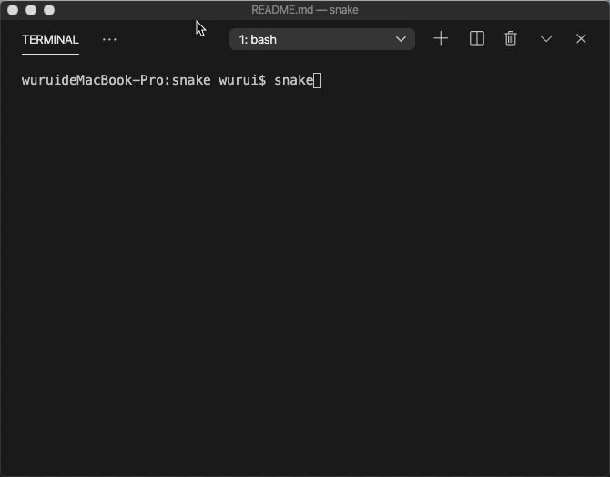

# Game snake written in go, No third-dependence

[](https://cloud.drone.io/woorui/snake)
[](https://github.com/woorui/snake/actions/workflows/docker-publish.yml)
[](https://github.com/woorui/snake/actions/workflows/docker-image.yml)

The snake is controlled with `w`, `a`, `s` and `d`, It don't support windows (but docker supported).

## Install

```bash
go install github.com/woorui/snake
```

## Flags

```bash
> snake -h
Usage of snake:
  -height int
        game stage height (default 12)
  -speed int
        game speed, duration between two frames (default 120)
  -width int
        game stage width (default 25)
```

## Run

```bash
snake
```



## Run with docker

see here: https://github.com/woorui/snake/pkgs/container/snake
