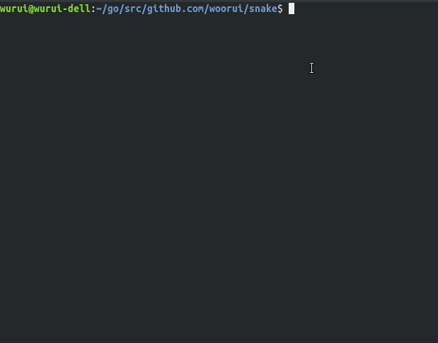

## Game snake written in go

The snake is controlled with `w`, `a`, `s` and `d`.It don't support windows (but docker below)

### Running in the project directory without building, just for testing
> go run $(ls -1 *.go | grep -v _test.go)

### Installation
> go get -u github.com/woorui/snake

### Run the game snake if you has setup the go environment variable
> snake

### Running in docker (It's don't need go env but docker installed)
> docker run -it --rm qq1009479218/snake

### The test is being completed...
